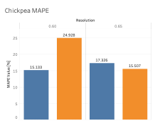
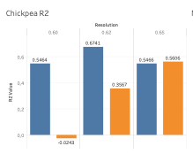

# AI-Driven Background Segmentation for 3D Plant Phenotyping

This repository contains the workflow, visual outputs, and evaluation results of an AI-based method for background segmentation from 3D plant scans.  
The full source code and trained model will be released after the acceptance and publication of the associated paper.

---

## Paper and Citation

**Title:** Using MLP to Improve Background Segmentation of 3D Plant Scans and Accuracy of Trait Assessment in Phenomics  
**Authors:** SK, JM, TharanyaM, JK, AG, RekhaB, Vojtěch Mikeš, KIT, PSX  
**Journal:** IEEE Access (under submission)  
**Link:** *(will be added after publication)*

Please cite as:

> **Note:** The full citation will be added once the paper is published.  
> Until then, this repository remains partially restricted (code and model release pending).

---

## Table of Contents

- [Paper and Citation](#paper-and-citation)
- [Repository Structure](#repository-structure)
- [Overview of the Full Workflow](#overview-of-the-full-workflow)
- [The Preprocessing Pipeline](#the-preprocessing-pipeline)
- [Final Trained Model](#final-trained-model)
- [Source Code Usage](#source-code-usage)
  - [Running Preprocessing](#running-preprocessing)
  - [Running Inference](#running-inference)
  - [Training or Retraining the Model](#training-or-retraining-the-model)
- [Example Outputs](#example-outputs)
- [Sample Dataset](#sample-dataset)
- [License](#license)
- [Contributing & Contact](#contributing--contact)

---

## Overview of the Full Workflow

The overall workflow includes data preprocessing, annotation, model training and evaluation:


<p align="center">
<em>Overall pipeline of preprocessing, training, and evaluation.</em>
</p>

---

## The Preprocessing Pipeline

Preprocessing transforms raw scanner data before model input:

- Rotation (align scans)
- Merging dual scanner outputs
- Voxelization
- Color smoothing


<p align="center">
<em>Detailed preprocessing steps for preparing input data.</em>
</p>

---

## Final Trained Model

A Multi-Layer Perceptron (MLP) model trained with:

- **Input:** 8 features (R, G, B, NIR, X, Y, Z)
- **Hidden Layers:** 10-50-50 neurons
- **Activation:** ReLU (hidden), Sigmoid (output)
- **Loss:** Binary Crossentropy
- **Optimization:** Adam, early stopping


<p align="center">
<em>Architecture of the binary classifier model.</em>
</p>

---

## Source Code Usage

> ⚠️ **Note:** The following scripts are currently placeholders.  
> Full code will be available after paper acceptance.

---

### Running Preprocessing

```bash
python code/preprocessing.py --input_folder data/raw --output_folder data/preprocessed
```

---

### Running Inference

```bash
python code/inference.py --model_path data/trained_model/final_mlp_model.h5 --input_folder data/preprocessed --output_folder data/results
```

---

### Training or Retraining the Model

```bash
python code/train_model.py --data_folder data/preprocessed --save_model_to data/trained_model
```

> Hyperparameter tuning performed using [Keras Tuner](https://keras.io/keras_tuner/)

---

## Example Outputs

### Leaf Points Segmentation


<p align="center">
<em>This figure shows example point clouds of chickpea plants after background segmentation. Black points represent plant structures identified by the classical coordinate-based method, while red points correspond to additional plant structures successfully recovered by the AI-based method.</em>
</p>

---

### Whole Plant Segmentation Examples

  


---

### Trait Estimation Metrics

<p align="center">
   
  
</p>

<p align="center">
<em>Evaluation of Leaf Area Estimation across species and voxel resolutions.</em>
</p>

---

### Generalization to Urban Data


<p align="center">
<em>Inference result on the Paris-Lille urban 3D point cloud dataset shows effective ground-object separation.</em>
</p>

---

## Sample Dataset

We provide a sample dataset for the chickpea plant to demonstrate the output of both our proposed pipeline and the classical method.

### Contents:
- Raw 3D scans from two different camera views
- Segmented output using our proposed **AI-based method**
- Segmented output using a **classical height-based approach**

**Download the sample dataset (~200MB):**  
[View on Figshare](https://figshare.com/articles/dataset/Sample_3D_Chickpea_Dataset_for_AI-Based_and_Classical_Plant_Segmentation/28796219)

> Note: The full dataset and intermediate results will be released after the publication of our related research article.  
> If you need early access, please contact us.

---

## License

Licensed under the Apache License 2.0.  
See [LICENSE.md](LICENSE.md)

---

## Contributing & Contact

We welcome collaboration!

- **Serkan Kartal (Çukurova University):** [serkankartal@cu.edu.tr](mailto:serkankartal@cu.edu.tr)  
- **Jan Masner (CZU Prague):** [masner@pef.czu.cz](mailto:masner@pef.czu.cz)  
- **Jana Kholová (CZU, ICRISAT):** [kholova@pef.czu.cz](mailto:kholova@pef.czu.cz)

---

_“Enhancing 3D plant phenotyping through efficient and robust AI-based background segmentation.”_
