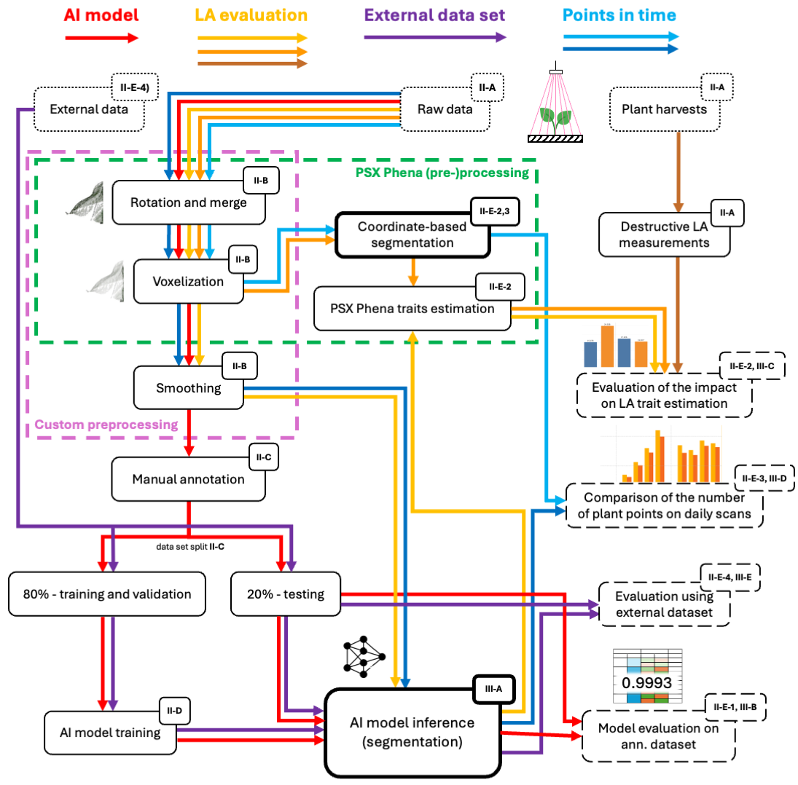

# AI-Driven Background Segmentation for 3D Plant Phenotyping

This repository contains the workflow, visual outputs, and evaluation results of an AI-based method for background segmentation from 3D plant scans.  
The full source code and trained model will be released after the acceptance and publication of the associated paper.

---

## Paper and Citation

**Title:** Using MLP to Improve Background Segmentation of 3D Plant Scans and Accuracy of Trait Assessment in Phenomics  
**Authors:** SK, JM, TharanyaM, JK, AG, RekhaB, Vojtěch Mikeš, KIT, PSX  
**Journal:** IEEE Access (under submission)  
**Link:** *(will be added after publication)*

Please cite as:

> **Note:** The full citation will be added once the paper is published.  
> Until then, this repository remains partially restricted (code and model release pending).

---

## Table of Contents

- [Paper and Citation](#paper-and-citation)
- [Repository Structure](#repository-structure)
- [Overview of the Full Workflow](#overview-of-the-full-workflow)
- [The Preprocessing Pipeline](#the-preprocessing-pipeline)
- [Final Trained Model](#final-trained-model)
- [Source Code Usage](#source-code-usage)
  - [Running Preprocessing](#running-preprocessing)
  - [Running Inference](#running-inference)
  - [Training or Retraining the Model](#training-or-retraining-the-model)
- [Example Outputs](#example-outputs)
- [Sample Dataset](#sample-dataset)
- [License](#license)
- [Contributing & Contact](#contributing--contact)
 

---

 # 🔹 Overview of the Full Workflow

The overall workflow includes data preprocessing, annotation, model training and evaluation:




---

## Raw Data Preprocessing

The dataset includes a preprocessing code that can be used for the raw point cloud data. The key steps include:

1.  **Rotation** of point clouds to align the plant on the x-plane.
2.  **Merging** merging the point clouds from the two scanners into one file.
3.  **Voxelization** to adjust the resolution of the point cloud.
4.  **Soil Segmentation** to separate plants from soil and trays using AI-based algorithms.

Refer to the published paper for detailed description.
 


---


# 🔹 Final Trained Model

The background segmentation model is a **Multi-Layer Perceptron (MLP)** with:

- **Input:** 7 features (RGB + XYZ + NIR)
- **Hidden layers:** 10-50-50 neurons
- **Activation:** ReLU
- **Output:** 1 neuron (sigmoid activation)

**Model Architecture:**  


---
## 🌱 Sample Dataset

We provide a sample dataset for the chickpea plant to demonstrate the output of both our proposed pipeline and the classical method.

### 📦 Contents:
- Raw 3D scans from two different camera views
- Segmented output using our proposed **AI-based method**
- Segmented output using a **classical height-based approach**

📥 **Download the sample dataset (~200MB)**:  
👉 [View on Figshare](https://figshare.com/articles/dataset/Sample_3D_Chickpea_Dataset_for_AI-Based_and_Classical_Plant_Segmentation/28796219)

> 🛑 The full dataset and intermediate results will be released after the publication of our related research article.  
> If you need early access, please contact us.
> 
---

# 🔹 Source Code Usage

> ⚠️ **Note:** `.py` source code files are currently placeholders.  
> Full code will be uploaded after paper acceptance.

---

## Running Preprocessing

```bash
python code/preprocessing.py --input_folder data/raw --output_folder data/preprocessed
```

---

## Running Inference

```bash
python code/inference.py --model_path data/trained_model/final_mlp_model.h5 --input_folder data/preprocessed --output_folder data/results
```

---

## Training or Retraining the Model

```bash
python code/train_model.py --data_folder data/preprocessed --save_model_to data/trained_model
```

Hyperparameter tuning using [Keras Tuner Documentation](https://keras.io/keras_tuner/).

---

# 🔹 Example Outputs

### 🔹 Leaf Points Segmentation Results
 


<p align="center">
<em>This figure shows example point clouds of chickpea plants after background segmentation. Black points represent plant structures identified by the classical coordinate-based method, while red points correspond to additional plant structures successfully recovered by the AI-based method.</em>
</p>

---

### 🔹 Whole .ply File Segmentation 


---

### 🔹 Generalization on Paris-Lille Dataset


---

## License

This dataset and associated code are released under the [Apache License 2.0](LICENSE.md).

---


## Contributing & Contact

We welcome ideas and collaborations!  
Feel free to reach out for data extension or model improvements.

- **Serkan Kartal (Çukurova University):** [serkankartal@cu.edu.tr](mailto:serkankartal@cu.edu.tr)  
- **Jan Masner (CZU Prague):** [masner@pef.czu.cz](mailto:masner@pef.czu.cz)  
- **Jana Kholová (CZU, ICRISAT):** [kholova@pef.czu.cz](mailto:kholova@pef.czu.cz)


---
_"Enhancing 3D plant phenotyping through efficient and robust AI-based background segmentation."_
