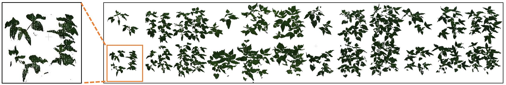

# AI-Driven Background Segmentation for High-Throughput 3D Plant Scans

This repository contains the workflow, visual outputs, and evaluation results of an AI-based method for background segmentation from 3D plant scans.  
---

## Paper and Citation

**Title:** AI-Driven Background Segmentation for High-Throughput 3D Plant Scans  
**Authors:** SK, JM, TharanyaM, JK, AG, RekhaB, Vojtěch Mikeš, KIT, PSX  
**Journal:** IEEE Access (under submission)  
**Link:** *(will be added after publication)*

Please cite as:

> **Note:** The full citation will be added once the paper is published.  
> Until then, this repository remains partially restricted (code and model release pending).

---

## Table of Contents

- [Paper and Citation](#paper-and-citation)
- [Overview of the Full Workflow](#-overview-of-the-full-workflow)
- [Raw Data Preprocessing](#raw-data-preprocessing)
- [Final Trained Model](#-final-trained-model)
- [Sample Dataset](#-sample-dataset)
- [Processing Your Own Raw Data](#-processing-your-own-raw-data)
  - [Required Input Format](#️-required-input-format)
  - [Environment Setup](#️-environment-setup)
- [Running the Code](#running-the-code)
  - [Training or Retraining the Model](#training-or-retraining-the-model)
  - [Running Plant-Background Segmentation](#running-plant-backgorund-segmentation)
- [Example Outputs](#-example-outputs)
- [License](#license)
- [Contributing & Contact](#contributing--contact)

 

---

 # 🔹 Overview of the Full Workflow

The overall workflow includes data preprocessing, annotation, model training and evaluation:


---

## Raw Data Preprocessing

The dataset includes a preprocessing code that can be used for the raw point cloud data. The key steps include:

1.  **Rotation** of point clouds to align the plant on the x-plane.
2.  **Merging** merging the point clouds from the two scanners into one file.
3.  **Voxelization** to adjust the resolution of the point cloud.
4.  **Smoothing** to reduce noise by averaging color values with neighboring points. 

Refer to the published paper for detailed description.
 


---


# 🔹 Final Trained Model

The background segmentation model is a **Multi-Layer Perceptron (MLP)** with:

- **Input:** 7 features (RGB + XYZ + NIR)
- **Hidden layers:** 10-50-50 neurons
- **Activation:** ReLU
- **Output:** 1 neuron (sigmoid activation)

**Model Architecture:**  


---
## 🌱 Sample Dataset

We provide a sample dataset for to demonstrate the output of both our proposed pipeline and the classical method.

### 📦 Contents:
- Raw 3D scans from two different camera views
- Segmented output using our proposed **AI-based method**
- Segmented output using a **classical height-based approach**

📥 **Download the sample dataset **: 

Replace the existing data folder in the GitHub repository with the one you downloaded.

👉 [View on Figshare](https://figshare.com/articles/dataset/Sample_3D_Chickpea_Dataset_for_AI-Based_and_Classical_Plant_Segmentation/28796219)

--- 
You can train your own segmentation model by running the `TrainSegmentation.py` code located under `NN_Codes`, after preparing your data in the appropriate format within the `data` folder.

Once your model is trained, it can be used for segmenting new data. Before segmentation, raw data must be prepared using the preprocessing steps described in the documentation, including rotation, merging, and voxelization, which require the Phenospex executable. All of these steps are automated within the Preprocess.py script. When you run this script, it will:

- Automatically detect and preprocess any new, unprocessed data,

- Apply the segmentWithMLPPhenospex function to distinguish plant points from soil/background,

- Execute evaluation and postprocessing functions to generate and save all necessary output files and results.

This enables an end-to-end segmentation pipeline with minimal manual intervention.

The data will be saved in the `./data/` folder.

## 🔄 Processing Your Own Raw Data

To process your own 3D plant scans using the AI-based segmentation pipeline provided in this repository, follow the simple steps below. The entire workflow—from raw data preprocessing to AI-driven background segmentation and final trait estimation—is fully automated after placing your raw files in the appropriate folder.

### 🗂️ Required Input Format

Your raw scan files must follow the same structure as the sample data provided. Each scan should consist of two `.ply` files (from the two scanner angles) for each barcode (i.e., microplot sector).

* Example:

```

data/raw_data/
├── barcode_001/
│   ├── scan_001_a.ply
│   └── scan_001_b.ply

```
---

### 🛠️ Environment Setup

Before running the code, make sure to install the required Python packages using the provided `requirements.txt` file:

```bash
pip install -r requirements.txt
```

### 💡 Optional but recommended: Use a virtual environment to keep dependencies isolated:
```
python -m venv venv
source venv/bin/activate   # On Windows: venv\Scripts\activate
pip install -r requirements.txt

This will install all the necessary packages (e.g., TensorFlow, scikit-learn, Open3D) with the correct versions to ensure compatibility with the codebase.
```
--- 
 
## Training or Retraining the Model

```bash
python NN_Codes/TrainSegmentation.py  
```

## Running Plant-Backgorund Segmentation

```bash
python Preprocess.py  
```

Hyperparameter tuning using [Keras Tuner Documentation](https://keras.io/keras_tuner/).

---

# 🔹 Example Outputs

### 🔹 Leaf Points Segmentation Results
 


<p align="center">
<em>This figure shows example point clouds of chickpea plants after background segmentation. Black points represent plant structures identified by the classical coordinate-based method, while red points correspond to additional plant structures successfully recovered by the AI-based method.</em>
</p>

---

### 🔹 Whole .ply File Segmentation 




---

### 🔹 Generalization on Paris-Lille Dataset


---

## License

This dataset and associated code are released under the [Apache License 2.0](LICENSE.md).

---


## Contributing & Contact

We welcome ideas and collaborations!  
Feel free to reach out for data extension or model improvements.

- **Serkan Kartal (Çukurova University):** [serkankartal@cu.edu.tr](mailto:serkankartal@cu.edu.tr)  
- **Jan Masner (CZU Prague):** [masner@pef.czu.cz](mailto:masner@pef.czu.cz)  
- **Jana Kholová (CZU, ICRISAT):** [kholova@pef.czu.cz](mailto:kholova@pef.czu.cz)


---
_"Enhancing 3D plant phenotyping through efficient and robust AI-based background segmentation."_
