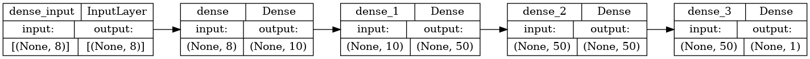

# Annotated 3D Point Cloud Dataset of High-Throughput Plant Scans 

Living [repository](https://github.com/kit-pef-czu-cz/3d-point-cloud-dataset-plants) of **3D Point Cloud plant scans**. This dataset provides high-throughput, organ-level annotated 3D point cloud scans of plants, collected using the LeasyScan phenotyping platform.

The original, fixed repository can be found at Figshare: https://doi.org/10.6084/m9.figshare.28270742 

If you find the dataset useful, please cite the original paper **Annotated 3D Point Cloud Dataset of Broad-Leaf Legumes Captured by High-Throughput Phenotyping Platform** published in Scientific Data:

```
CITATION
```

---

## Table of Contents

- [Dataset Overview](#dataset-overview)
- [File Structure](#file-structure)
- [Data Acquisition](#data-acquisition)
- [Data Annotation](#data-annotation)
- [Data Format](#data-format)
- [Overview of the Full Workflow](#overview-of-the-full-workflow)
- [Raw Data Preprocessing](#raw-data-preprocessing)
- [Final Trained Model](#final-trained-model)
- [Source Code Usage](#source-code-usage)
  - [Running Preprocessing](#running-preprocessing)
  - [Running Inference](#running-inference)
  - [Training or Retraining the Model](#training-or-retraining-the-model)
- [Example Outputs](#example-outputs)
- [License](#license)
- [Contributing-Collaborating](#contributing-collaborating)
- [Acknowledgements](#acknowledgements)
- [Contact](#contact)

---

## Dataset Overview

This dataset includes annotated 3D point cloud scans of several plant species for various plant organs (e.g., embryonic leaves, petioles, stems, etc.).  
The data was collected using the LeasyScan high-throughput phenotyping platform, which uses **Phenospex PlantEye F600** scanners.

| Name                                               | 	Count |
|----------------------------------------------------|--------|
| **Total number of scans**                          | 	223   |
| Scans of common bean species                       | 	50    |
| Scans of cowpea species                            | 	45    |
| Scans of lima bean species                         | 	58    |
| Scans of mungbean species                          | 	71    |
| **Scans with all plants annotated using organs**   | 	141   |
| Scans containing plants unannotated using organs   | 	85    |
| Scans containing some unannotated plants           | 	3     |
| **Annotated classes**                              | 	5     |
| **Annotated objects (all classes)**                | 	3,712 |
| Annotated objects (Embryonic leaf)                 | 	1287  |
| Annotated objects (Leaf)                           | 	1224  |
| Annotated objects (Petiole)                        | 	814   |
| Annotated objects (Stem)                           | 	88    |
| Annotated objects (Plant)                          | 	299   |

---

## Dataset Structure

```bash
root/
│
├── data/
│   ├── Generated cuboid annotations/
│   ├── Point clouds/
│   ├── Annotation data.csv
│   ├── Raw data.zip
│   ├── Segments-ai annotation format.md
│   └── Segments-ai annotations.json
│
├── code/
│   ├── preprocess.py
│   └── generate_cuboids.py
│
├── LICENSE.md
└── README.md
```

---

## Data Acquisition

The presented data were generated using a commercially available PlantEye technology (F600), which is a unique plant phenotyping sensor that combines a 3D scanner with multispectral imaging ([PlantEye F600 multispectral 3D scanner for plants - PHENOSPEX](https://phenospex.com/products/plant-phenotyping/planteye-f600-multispectral-3d-scanner-for-plants/)).
The provided data comes from three regular experimentations in 2022 and 2023 at the ICRISAT field (located in Hyderabad, India). Please see the published paper for details. 

---


## Data Annotation
The data were annotated using the online platform Segments.ai (https://segments.ai) under an academic license.
Annotations are provided for the following plant organs:

*   Embryonic leaf
*   Leaf
*   Petiole
*   Stem
*   Plant

The Plant class was added for the plants that are, e.g., distorted by wind and do not allow humans to distinguish the plant organs.

## Data Format

* Raw data are proviuded in **.PLY format**; see https://paulbourke.net/dataformats/ply/ for details. 
* Annotated point clouds are provided in **.PCD format**; see https://pcl.readthedocs.io/projects/tutorials/en/latest/pcd_file_format.html for details.
* Annotations:
  * Generated cuboids are using KITTI format; see https://github.com/dtczhl/dtc-KITTI-For-Beginners/blob/master/README.md for details.
  * Segmentation annotations are in the original format from the Segments.ai platform, see `Segments-ai annotation format.md`.

---

 # 🔹 Overview of the Full Workflow

The full methodology for data acquisition, preprocessing, annotation, model training, and evaluation is illustrated below.


---

## Raw Data Preprocessing

The dataset includes a preprocessing code that can be used for the raw point cloud data. The key steps include:

1.  **Rotation** of point clouds to align the plant on the x-plane.
2.  **Merging** merging the point clouds from the two scanners into one file.
3.  **Voxelization** to adjust the resolution of the point cloud.
4.  **Soil Segmentation** to separate plants from soil and trays using AI-based algorithms.

Refer to the published paper for detailed description.
 


---


# 🔹 Final Trained Model

The background segmentation model is a **Multi-Layer Perceptron (MLP)** with:

- **Input:** 7 features (RGB + XYZ + NIR)
- **Hidden layers:** 10-50-50 neurons
- **Activation:** ReLU
- **Output:** 1 neuron (sigmoid activation)

**Model Architecture:**  


---

# 🔹 Source Code Usage

> ⚠️ **Note:** `.py` source code files are currently placeholders.  
> Full code will be uploaded after paper acceptance.

---

## Running Preprocessing

```bash
python code/preprocessing.py --input_folder data/raw --output_folder data/preprocessed
```

---

## Running Inference

```bash
python code/inference.py --model_path data/trained_model/final_mlp_model.h5 --input_folder data/preprocessed --output_folder data/results
```

---

## Training or Retraining the Model

```bash
python code/train_model.py --data_folder data/preprocessed --save_model_to data/trained_model
```

Hyperparameter tuning using [Keras Tuner Documentation](https://keras.io/keras_tuner/).

---

# 🔹 Example Outputs

### 🔹 Leaf Area Estimation Results
 


<p align="center">
<em>This figure shows example point clouds of chickpea plants after background segmentation. Black points represent plant structures identified by the classical coordinate-based method, while red points correspond to additional plant structures successfully recovered by the AI-based method.</em>
</p>

---

### 🔹 Whole .ply File Segmentation 


---

### 🔹 Generalization on Paris-Lille Dataset


---

# License

This dataset and associated code are released under the [Apache License 2.0](LICENSE.md).

---

# Contributing-Collaborating

We welcome ideas and collaborations!  
Feel free to reach out for data extension or model improvements.

---

# Acknowledgements

- CZU Prague (Czech University of Life Sciences Prague)
- ICRISAT (International Crops Research Institute for the Semi-Arid Tropics)
- Phenospex (scanner manufacturer)
- Segments.ai (annotation platform)

---

## Contact

For questions or collaborations, please contact:

* **Jan Masner**: CZU Prague; [masner@pef.czu.cz](mailto:masner@pef.czu.cz) (technical area)
* or **Jana Kholová**: CZU Prague and ICRISAT (formerly); [kholova@pef.czu.cz](mailto:kholova@pef.czu.cz) (plant phenotyping)

---
_"Enhancing 3D plant phenotyping through efficient and robust AI-based background segmentation."_
